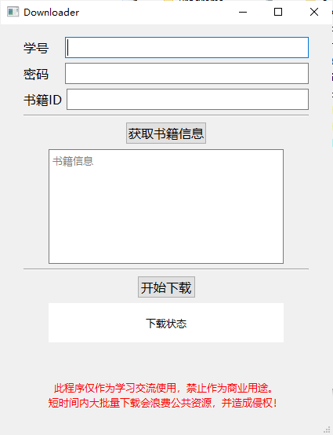
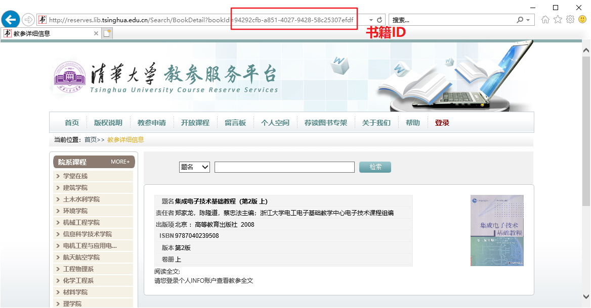

# GetReverse

清华大学教参服务平台下载工具



书籍ID：




## 功能

- [x] 获得书籍信息
- [x] 批量下载图片
- [ ] 打包发布
- [ ] 图片合成 PDF
- [ ] 断点续传
- [ ] 多浏览器支持
- [ ] chromedriver 自动下载

## 执行

安装 Chrome 浏览器，并下载对应自己浏览器版本的 chromedriver.exe 放在 python 目录下。

- Chrome 版本：在地址栏输入`chrome://version/`，第一行
- 版本对应下载：https://npm.taobao.org/mirrors/chromedriver/

安装 Python 包：

```bash
pip install -r requirements.txt
```

执行：

```bash
python gui.py
```

## [版权说明](http://reserves.lib.tsinghua.edu.cn/Privacy)

为了支持我校教学科研的需要，图书馆在校园网范围内为全校师生提供教参服务。请读者自觉遵守《著作权法》、《信息网络传播权保护条例》等相关法律法规规定，自觉维护“[清华大学图书馆维护知识产权声明](http://lib.tsinghua.edu.cn/about/policy_bqsm.html)”。对于违规使用本教参系统及图书馆所提供电子资源的读者，将按照图书馆“[关于版权的公告](http://www.lib.tsinghua.edu.cn/database/copyright.html)”中的相关规定进行处理。

**此程序仅作为学习交流使用，禁止作为商业用途。**
**短时间内大批量下载会浪费公共资源，并造成侵权！**
